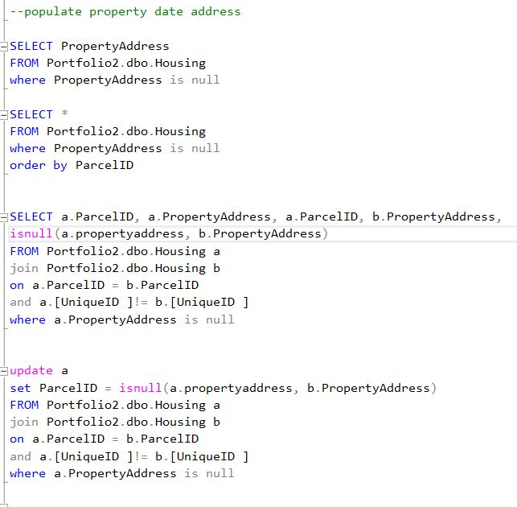
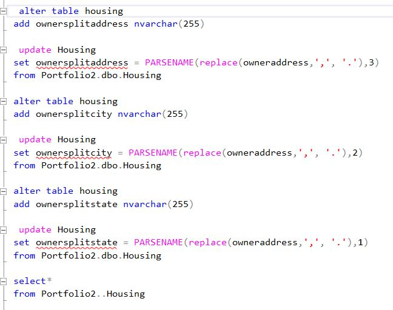
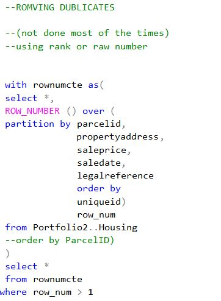

### welcome to
# Nashville Housing Data: Data cleaning using SQL
## In This Project I Clean Housing Data in SQL Server Using Various Queries and Show skills in Seperating, Standardizing, and Choosing Useful Data for Further Analyzing and Usage.
### and I will be explaining the whole process below:
## -Used the Dataset from Kaggle [Nashville Housing Data](https://www.kaggle.com/datasets/tmthyjames/nashville-housing-data)
## -Opened the data set in Excel to Explore it and drop the irrelevant data for further if exists
## -Imported the Data into SQL Server to start Exploring and Cleaning it futher performing the following changes using Queries:
   ###            [Here is SQL Queries Code!](https://github.com/safaamukhtar/PortfolioProjects/blob/DATA-CLEANING-IN-SQL/DATA%20CLEANING%20WITH%20SQL%20QUERIES%20PROJECT.sql)
   ### -Standarized the Date format throught out the whole data and updated the table
   ### -Populated the Property Address using self Joins
   ### 
   ### -Broke down the address column into 3 columns(street, city, state) using Substring and character index Functions and then updated the table
   ### 
   ### -Standarized y and n to Yes and No
   ### -Removed Duplicated using CTE and Row Number functions
   ### 
   ### -Dropped unused columns 
###               [Here are the Excel files Before and After quering the data](https://github.com/safaamukhtar/PortfolioProjects/blob/DATA-CLEANING-IN-SQL/Nashville%20Housing%20Data%20Before%20and%20After%20Cleaning%20with%20SQL.zip)
