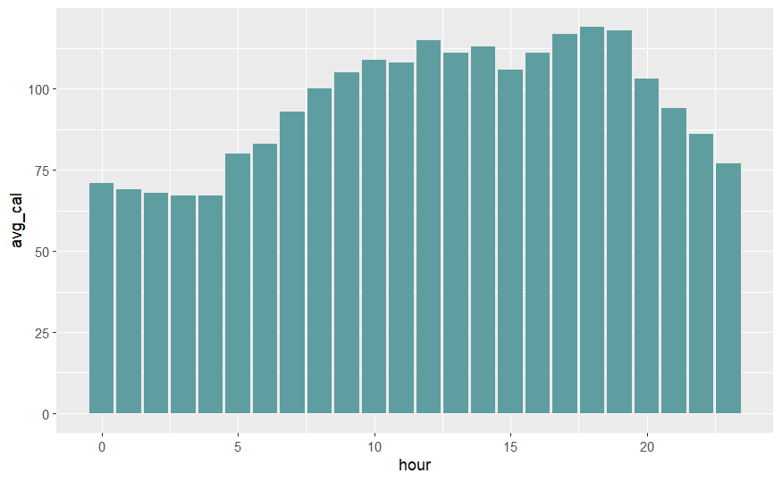

### welcome to
# Bellabeat Case Study: Complete Analysis using SQL, R and Tableau
### In This Project I Perform Analysis on the Data in SQL Server, Rsudio and Tableau Public using the Google data analytics' 6 steps data Analysis process
## This project is the Capstone project for the google Data Analytic professional Certificate Course

### Scenario
#### You are a junior data analyst working on the marketing analyst team at Bellabeat, a high-tech manufacturer of health-focused products for women. Bellabeat is a successful small company, but they have the potential to become a larger player in the global smart device market. Urška Sršen, cofounder and Chief Creative Officer of Bellabeat, believes that analyzing smart device fitness data could help unlock new growth opportunities for the company. You have been asked to focus on one of Bellabeat’s products and analyze smart device data to gain insight into how consumers are using their smart devices. The insights you discover will then help guide marketing strategy for the company. You will present your analysis to the Bellabeat executive team along with your high-level recommendations for Bellabeat’s marketing strategy.

## Ask

### Business Task

#### What are some trends in smart device usage Data How could we apply to Bellabeat customers and How can these trends help influence Bellabeat marketing strategy?

### Stakeholders

####  Bellabeat’s cofounders and Bellabeat marketing analytics team


## Prepare

### Data about The Data

#### The dataset is a Public dataset available [Kaggle](https://www.kaggle.com/datasets/arashnic/fitbit) 
#### The data is a third party data with limitation 
#### the data doesn't provide personal data about the users age, chronic diseases, life style, type of activities 
#### it is not ROCCC (the data is not recent and the Sample is too small)
#### the data is relevant to the business task questions

## Process

### The data cleaning and Manipulation Process

#### looking at the data size using SQL to Process and R to Visualize is a good Option


### Documentation of data Cleaning Process:


### Set Enviroment to Excute SQL Queries in R Markdown  

```{r echo=TRUE, message=FALSE, warning=FALSE}
library(DBI)
```

### Connect to Ms SQL Server Database

```{r}
con <- DBI::dbConnect(odbc::odbc() ,
                      Driver   = "SQL Server",
                      Server   = "BOK-BCP-288",
                      Database = "bellabeat",
                      port     = 1433)
```

### Cleaning the data 

#### -removing duplicates
#### -standarize the data
#### -address null values
#### -overlook tables, columns and rows not relevant to our analysis


### Explore tables

```{sql connection=con, output.var = "output_table", echo=T, warning=F, message=F,eval=F}

SELECT  DISTINCT ID FROM dailyActivity_month --35 id
SELECT  DISTINCT ID FROM hourlyCalories_month --34 id
SELECT  DISTINCT ID FROM hourlyIntensities_month --34 id
SELECT  DISTINCT ID FROM hourlySteps_month --34 id
SELECT  DISTINCT ID FROM minuteCaloriesNarrow_month --34 id
SELECT  DISTINCT ID FROM minuteIntensitiesNarrow_month --34 id
SELECT  DISTINCT ID FROM minuteMETsNarrow_month --34 id
SELECT  DISTINCT ID FROM minuteStepsNarrow_month -- 34 id
SELECT  DISTINCT ID FROM minuteSleep_month --23 id
SELECT  DISTINCT ID FROM weightLogInfo_month -- 11 id
```

##### Data sample in table weight is too small so it will be overlooked

```{sql eval=F, echo=T, message=FALSE, warning=FALSE, connection=con, output.var="output_table"}

SELECT * FROM dailyActivity_month -- 457 rows
SELECT * FROM dailyActivity_merged -- 940 rows
SELECT * FROM hourlyCalories_month --24,084 rows
SELECT * FROM hourlyCalories_merged --22,099 rows
SELECT * FROM hourlyIntensities_month --24,084 rows
SELECT * FROM hourlyIntensities_merged --22,099 rows
SELECT * FROM hourlySteps_month --24,084 rows
SELECT * FROM hourlySteps_merged --22,099 rows
SELECT * FROM minuteCaloriesNarrow_month --1,445,040 rows
SELECT * FROM minuteCaloriesNarrow_merged --1,325,580 rows
SELECT * FROM minuteIntensitiesNarrow_month --1,445,040 rows
SELECT * FROM minuteIntensitiesNarrow_merged --1,325,580 rows
SELECT * FROM minuteMETsNarrow_month --1,445,040 rows
SELECT * FROM minuteMETsNarrow_merged --1,325,580 rows
SELECT * FROM minuteStepsNarrow_month --1,445,040 rows
SELECT * FROM minuteStepsNarrow_merged --1,325,580 rows
SELECT * FROM minuteSleep_month --198,559 rows
SELECT * FROM minuteSleep_merged --188,521 rows

```

##### tables with same columns will be merged


#### make a copy from our raw data to work on
#### join the tables with similar row numbers on Id and Datetime to make handling the tables more easier

#### Create Table 1

```{sql eval=F, echo=T, message=FALSE, warning=FALSE, connection=con, output.var="output_table"}

create table daily_data(id, ActivityDate, TotalSteps, VeryActiveMinutes, FairlyActiveMinutes, LightlyActiveMinutes, SedentaryMinutes)
 insert into daily_data (id, ActivityDate, TotalSteps, VeryActiveMinutes, FairlyActiveMinutes, LightlyActiveMinutes, SedentaryMinutes)
 select id, ActivityDate, TotalSteps, VeryActiveMinutes, FairlyActiveMinutes, LightlyActiveMinutes, SedentaryMinutes
 FROM dailyActivity_month
 union
select id , ActivityDate, TotalSteps, VeryActiveMinutes, FairlyActiveMinutes, LightlyActiveMinutes, SedentaryMinutes
 from dailyActivity_merged
```


```{sql eval=F, echo=T, message=FALSE, warning=FALSE, connection=con, output.var="output_table"}

select *
into sleep_data
from(
select id, convert(date, date) as 'Date',
sum(value) as minutes
from minuteSleep_month
where value = 1
group by id,convert(date, date), value
union
select id, convert(date, date) as 'Date',
sum(value) 
from minuteSleep_merged
where value = 1
group by id,convert(date, date), value
) a


 update daily_data 
set sleepminutes = (select minutes
from sleep_data where daily_data.id = sleep_data.id and daily_data.ActivityDate = sleep_data.date )
```


#### Create Table 2

```{sql eval=F, echo=T, message=FALSE, warning=FALSE, connection=con, output.var="output_table"}

select *
into #temp1
from hourlyCalories_month
union all
select * from hourlyCalories_merged

select *
into #temp2
from hourlyIntensities_month
union all
select * from hourlyIntensities_merged

select *
into #temp3
from hourlySteps_month
union all
select * from hourlySteps_merged

select * from #temp1
select * from #temp2
select * from #temp3

 SELECT a.id id, a.ActivityHour ActivityHour, a.Calories, b.TotalIntensity, b.AverageIntensity, c.StepTotal into hourly_data
FROM #temp1 a, #temp2 b, #temp3 c
where (a.id = b.id and a.id = c.id and a.activityhour = b.activityhour and a.ActivityHour = c.ActivityHour)
```


#### Create Table 3

```{sql eval=F, echo=T, message=FALSE, warning=FALSE, connection=con, output.var="output_table"}

select *
into #temp4
from minuteCaloriesNarrow_month
union all
select *
from minuteCaloriesNarrow_merged 

select *
into #temp5
from minuteIntensitiesNarrow_month
union all
select *
from minuteIntensitiesNarrow_merged 

select *
into #temp6
from minuteMETsNarrow_month
union all
select *
from minuteMETsNarrow_merged

select *
into #temp7
from minuteStepsNarrow_month
union all
select *
from minuteStepsNarrow_merged 

SELECT a.*, b.Intensity, c.METs, d.Steps into minute_data
FROM #temp4 a, #temp5 b,  #temp6 c, #temp7 d
where a.id = b.Id and b.id = c.Id and c.Id = d.Id
and a.ActivityMinute = b.ActivityMinute and b.ActivityMinute = c.ActivityMinute and c.ActivityMinute = d.ActivityMinute

```


### Manipulate the Data

#### Add columns with weekdays and day parts (morning, afternoon, evening,night)

```{sql eval=F, echo=T, message=FALSE, warning=FALSE, connection=con, output.var="output_table"}

alter table daily_data add week_day nvarchar(50)


update daily_data 
set week_day = case
	when DATEpart(DW, ActivityDate) between 5 and 6
		THEN 'weeekend'
	else 'work_day'
	end 
```


```{sql eval=F, echo=T, message=FALSE, warning=FALSE, connection=con, output.var="output_table"}

select ActivityDate, week_day,
avg(cast(totalsteps as int)) steps, avg(cast(veryactiveminutes as int)) VeryActive,
avg( cast(FairlyActiveMinutes as int)) FailrlyActive,
avg(cast(LightlyActiveMinutes as int)) LightlyActive,
avg(cast(SedentaryMinutes as int)) SedentaryMinutes,
avg(cast(sleepminutes as int)) SleepMinutes
from daily_data
group by ActivityDate, week_day
order by ActivityDate
```

```{sql eval=F, echo=T, message=FALSE, warning=FALSE, connection=con, output.var="output_table"}

select avg(cast(totalsteps as int)) steps,
avg(SedentaryMinutes)/60 SedentaryHour,
avg(sleepminutes)/60 SleepHour
from daily_data
```

```{sql eval=F, echo=T, message=FALSE, warning=FALSE, connection=con, output.var="output_table"}

alter table hourly_data add day_part nvarchar(50)


update hourly_data 
set day_part = case
	when DATEPART(HH, ActivityHour) between 4 and 10
		THEN 'morning'
	when DATEPART(HH, ActivityHour) between 11 and 16
		then 'Afternoon'
	when datepart(HH, ActivityHour) between 17 and 20
		then 'evening'
	else 'night'
	end
```


## Analyze

```{sql eval=F, echo=T, message=FALSE, warning=FALSE, connection=con, output.var="output_table"}

select  day_part, DATEPART(HH, ActivityHour) hour,
avg(cast(calories as int)) avg_cal, avg(cast(steptotal as int))avg_step
from hourly_data
group by  day_part, DATEPART(HH, ActivityHour)
order by DATEPART(HH, ActivityHour)
```

```{sql eval=F, echo=T, message=FALSE, warning=FALSE, connection=con, output.var="output_table"}

select id, convert(date, ActivityHour) day_,
sum(Calories) cal,
sum(StepTotal) step
from hourly_data
group by id, convert(date, ActivityHour)
order by 1,2
```

```{sql eval=F, echo=T, message=FALSE, warning=FALSE, connection=con, output.var="output_table"}

select convert(date, ActivityHour) day_,
(sum(cast(calories as int))/ count(distinct id)) cal,
(sum(cast(steptotal as int))/ count(distinct id))step
from hourly_data
group by  convert(date, ActivityHour)
order by 1,2

```

```{sql eval=F, echo=T, message=FALSE, warning=FALSE, connection=con, output.var="output_table"}

select substring(cast(ActivityHour as nchar),12,8) HourOfDay,
DATEPART(HH, ActivityHour) as hour,
day_part,
avg(cast(Calories as int)) Calories,
avg(cast(StepTotal as int)) steps
	from hourly_data
	group by substring(cast(ActivityHour as nchar),12,8), DATEPART(HH, ActivityHour), day_part
	order by DATEPART(HH, ActivityHour)
```


```{sql eval=F, echo=T, message=FALSE, warning=FALSE, connection=con, output.var="output_table"}

select 
convert(Date, activityhour) as Date,
sum(cast(calories as int))/count(distinct id) sum_calories
from hourly_data
group by convert(Date, activityhour)
order by 1

```


```{sql eval=F, echo=T, message=FALSE, warning=FALSE, connection=con, output.var="output_table"}

select convert(date, activityminute), 
sum(cast(Calories as int)) /count(distinct(convert(date, activityminute))),
sum(Intensity),
sum(METs),
sum(Steps)
from minute_data
group by  convert(date, activityminute)

```


```{sql eval=F, echo=T, message=FALSE, warning=FALSE, connection=con, output.var="output_table"}

select sum(cast(Calories as int)) /(2*34) calories_month,
sum(cast(Intensity as int))/(2*34) intensity_month,
sum(METs)/(2*34) METs_month,
sum(Steps)/(2*34) step_month
from minute_data

```


```{sql eval=F, echo=T, message=FALSE, warning=FALSE, connection=con, output.var="output_table"}

select sum(cast(Calories as int)) /(31*34) calories_day,
sum(cast(Intensity as int))/(31*34) intensity_day,
sum(METs)/(31*34) METs_day,
sum(Steps)/(31*34) step_day
from minute_data

```


## Share

```{r message=FALSE, warning=FALSE, include=FALSE}
library(tidyr)
library(tidyverse)
library(ggplot2)
library(readr)
library(dplyr)
```


```{r include=FALSE}
view1_df <- read_csv('C:/Users/Administrator/Documents/safaa/Bellabit/view1.csv')
```


```{r include=FALSE}
view2_df <- read_csv('C:/Users/Administrator/Documents/safaa/Bellabit/view2.csv')
```


```{r include=FALSE}
view3_df <- read_csv('C:/Users/Administrator/Documents/safaa/Bellabit/view3.csv')
```


```{r include=FALSE}
view4_df <- read_csv('C:/Users/Administrator/Documents/safaa/Bellabit/view4.csv')
```


```{r include=FALSE}
view5_df <- read_csv('C:/Users/Administrator/Documents/safaa/Bellabit/view5.csv')
```


```{r include=FALSE}
view6_df <- read_csv('C:/Users/Administrator/Documents/safaa/Bellabit/view6.csv')
```


```{r}
ggplot(data = view3_df, aes(x = step, y = cal)) +
  geom_jitter(color = "red" )+
  geom_smooth(color="green")
```


```{r}
ggplot(data= view1_df, aes(x= week_day,y=steps))+
  geom_col(fill="cadetblue")
```


```{r}
ggplot(data= view2_df, aes(x= day_part,y=avg_step))+
  geom_col(fill="cadetblue")
```


```{r}
ggplot(data= view2_df, aes(x= hour,y=avg_step))+
  geom_col(fill="cadetblue")
```


```{r}
ggplot(data= view2_df, aes(x= day_part,y=avg_cal))+
  geom_col(fill="cadetblue")
```


```{r}
ggplot(data= view2_df, aes(x= hour,y=avg_cal))+
  geom_col(fill="cadetblue")
```



```{r echo=FALSE, message=FALSE, warning=FALSE}
ggplot(data = view1_df, aes(x = SedentaryMinutes, y =SleepMinutes)) +
  geom_point(color = "red" )+
  geom_smooth(color="green")
```


### More Visualization in Tableau


[Tableau Dashboard](https://public.tableau.com/views/BellabeatDashboard_17182766470810/Dashboard1?:language=en-US&:sid=&:display_count=n&:origin=viz_share_link)


## Analysis Summary:

### -Average Steps a day are 7280

### -Average Sedentary Hours a day are 16.5 Hours

### -Average Sleep Hours a Day are 6.5 hours

### -Users are more active in the middle of the week 

### -The Average Calories consumed a day is 2300 Calories

### -corelation between the number of steps and Calories recorded

### -Steps count is Higher on week days than on weekend

### -Steps counts is Higher in the afternoon and evening than the morning and the night

### -Calories count is relatively lower from 12-5 AM

### -intense activity minutes count is really low for all users

### -activities type is never recorded

### -no relation between Sedentary Hours and Sleep Hours


## Act

#### Insight and Conclusions gathered from analysis:
### -The data indicates that the smart device is good at collecting data but not at suggesting wellbeing tips for the users so marketing our product as a device to improve your wellbeing rather than just recording acurate data.

### -The sleeping Hours recorded for all users is below average so an alarm to notify about  time for sleep is a good idea.

### -The suggested steps count a day is 10000 so motiviting users to walk more by making a contribution board for example.

### -The minutes count for Activity intensity (very, fairly, light) doesn't specify the type of activity so personalizing according to the users routine and activities will help the users know if they are working out enough

### -Calories intake is the highest in the morning and the afternoon (Breakfast and Lunch) so helping users track  their sugar levels too might help users with chronic illnesses and diets  
### -online way to Calculate weight instead of manually recording it is needed


