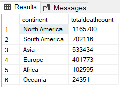
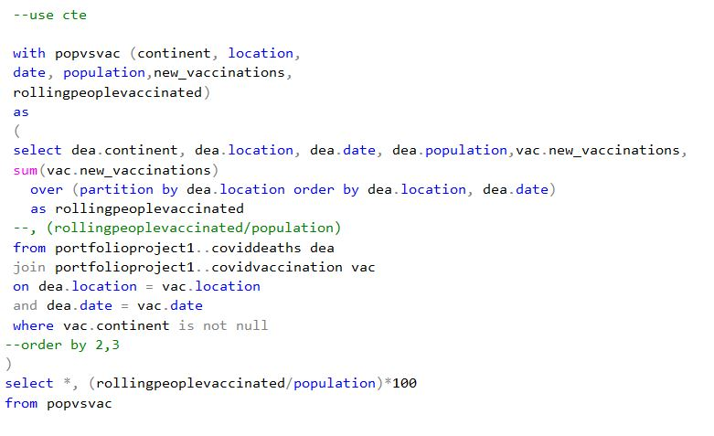

### welcome to
# Covid-19 Global Statistics: EDA using SQL and Excel
## In This Project I Explore a big amount of data about Covid-19 Global Numbers and Create Views from the data for Visualization (using Tableau).
### and I will be explaining the whole process below:
## -Used the Dataset from Data in our World website [Corona Virus](https://ourworldindata.org/coronavirus)
### [Here is the Raw data as I downloaded it from the website in January 2024](https://github.com/safaamukhtar/PortfolioProjects/blob/DATA-EXPLORATION-IN-SQL/raw-covid-data.zip)
## -Cleaned the data set in Excel to Explore it and drop the irrelevant data to prepare it for analysis and Created two tables (covid deaths and covid vaccinations)
###               [1. covid deaths](https://github.com/safaamukhtar/PortfolioProjects/blob/DATA-EXPLORATION-IN-SQL/coviddeaths.xlsx)              [2. covid vaccination](https://github.com/safaamukhtar/PortfolioProjects/blob/DATA-EXPLORATION-IN-SQL/covidvaccination.xlsx)
## -Impoted the Data into SQL Server to Explore and Clean it futher and create views for visualization performing the following changes using Queries:
   ###            [Here is SQL Queries Code!](https://github.com/safaamukhtar/PortfolioProjects/blob/DATA-EXPLORATION-IN-SQL/COVID-19%20GLOBAL%20NUMBERS%20PROJECT%20.sql)
   ### -Compared the total cases vs total deaths to shows the likelihood of dying by covid in your country
   ### 
   ### 
   ### 
   ### -Compared the total cases vs population to show what percentage of the population got covid-19
   ### 
   ### 
   ### -Explored the countries with highest infection rates compared to population and the highest death count per population
   ### 
   ### 
   ### -Explored the numbers after breaking them by continent(e.g total death count by continent)
   ### 
   ### 
   ### -Compared total population vs total vaccination using **CTE**, **Subqueries** and **Joins**
   ### 
   ### 
   ### 
   ### 
   ### 
   ### 
   ### -created views to visualize in Tableau (as shown above)
   ### [Covid-19 Dashboard](https://public.tableau.com/app/profile/safaa.mukhtar/viz/COVID-19_17089632880450/Dashboard1)

